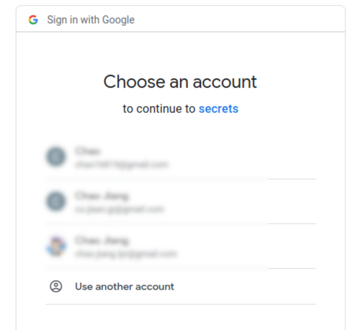

# Level 6 Authenticate your app with Google

**OAuth stands for Open Authorization**

when you using Google Oauth in your app, you are the client, and Google is the service provider.

to use OAuth , you need to

1. set up your app in Google Developers console, You will get an app id and app secret
1. redirect to Google/Facebook for authentication
3. user log in on google
2. user grant permission on prompt
7. receive Authorization code
3. get an access token to long term multiple access
---
install the package `passport-google-oauth20` and require it in app.js

## 6.1 create an application on Google Developers Console

1. create a project on [Google Developers Console](https://console.developers.google.com/)
1. go the `OAuth Consent Screen` , fill in info such as app name, contact email,
1. go to `credentials` to create `OAuth Client ID`
  1. authorized JavaScript origins: *http://localhost:3000*
  1. authorized redirect URL: *http://localhost:3000/auth/google/secrets*
  1. you will get a client id and client secret, put them in `.env` file

## 6.2 configure Strategy

### 6.2.1 in app.js require package

```JavaScript
//put this on top of code
const GoogleStrategy = require('passport-google-oauth20').Strategy;


//put the following code below serialize and de-serialize code
passport.use(new GoogleStrategy({
    clientID: process.env.CLIENT_ID,//client id and secret are in .env file for secruity prupose
    clientSecret: process.env.CLIENT_SECRET,
    callbackURL: "http://localhost:3000/auth/google/secrets",
    userProfileURL:'https://www.googleapis.com/oauth2/v3/userinfo'
  },
  function(accessToken, refreshToken, profile, cb) {
    User.findOrCreate({ googleId: profile.id }, function (err, user) {
      return cb(err, user);
    });
  }
));
```

### 6.2.2 install and load findOrCreate plugin

```JavaScript
const findOrCreate = require('mongoose-findorcreate');
//put plugin code under created userSchema
userSchema.plugin(findOrCreate);
```

### 6.2.3 create a '/auth/google' get route for the `sign in with google` button

```JavaScript
app.get('/auth/google',
  passport.authenticate('google', { scope: ['profile'] }));
//we set http://localhost:3000/auth/google/secrets as our callback url.
app.get('/auth/google/secrets',
    passport.authenticate('google', { failureRedirect: '/login' }),
    function(req, res) {
      // Successful authentication, redirect home.
      res.redirect('/secrets');
    });
```

### 6.2.4 update the serialize and de-serialize method

```JavaScript
passport.serializeUser(function(user, cb) {
  process.nextTick(function() {
    cb(null, { id: user.id, username: user.username, name: user.name });
  });
});

passport.deserializeUser(function(user, cb) {
  process.nextTick(function() {
    return cb(null, user);
  });
});
```
### 6.2.5 add a file in userSchema for googleId

```JavaScript
const userSchema = new mongoose.Schema({
  email: String,
  password: String,
  googleId:String,
  secret:[String]
});
```

by now, you should be able to login with google

-----------

# 7. Let users be able to share their secrets.

## 7.1 create a  `app.get("/submit")`

```JavaScript
app.get("/submit", (req,res)=>{
  req.isAuthenticated()?res.render("submit"): res.redirect("/login") //use isAuthenticated to check if the request is allowed.
})
```

## 7.2 set the `app.post("/submit")`

```JavaScript
app.post("/submit", (req,res)=>{
  const newSecret = req.body.secret;
  User.findById(req.user.id, (err, fundUser)=>{ //the passport package will bring user info in the req for submit
      if (err){
        console.log(err);
      } else {
        if (fundUser){
          fundUser.secret.push(newSecret);
          fundUser.save(()=>{//an callback to redirect to secrets
            res.redirect("/secrets")
          })
        }
      }
  })
})
```

remember that we altered the schema, Secret field are array objects, so we push new secrets to the secrets array.

## 7.3 update the `app.get("/secrets")`
the submit post will push new secrets to the secrets array in user document, and redirect to secrets route.

```JavaScript
app.get("/secrets", (req,res)=>{
  // req.isAuthenticated()?res.render("secrets"): res.redirect("/login") //use isAuthenticated to check if the request is allowed.
User.find({secret:{$ne:null}}, (err, foundUser)=>{ //looking for users with secrets
  if (err){
    console.log(err);
  } else {
    if (foundUser){
      console.log(fundUser);
      console.log(typeof foundUser);
      res.render("secrets", {toPass:foundUser}) //useing ejs to pass  foundUser to secrets.ejs
    }
  }
})
})
```

## 7.4 update the secrets.ejs

Note we passed an array of user documents to secrets.ejs

and inside each user document, the secret filed is an array itself

so we will use forEach twice here.


```JavaScript
<%toPass.forEach((user)=>{%> //passed from app.js
  <% var secret = user.secret %>
  <%  secret.forEach((item)=>{ %>  //secret is an array object
      <p class="secret-text"><%= item %></p>
    <%})%>
<%})%>
```

---

## after finishing , you should see

the google login prompt



and the secrets in database


